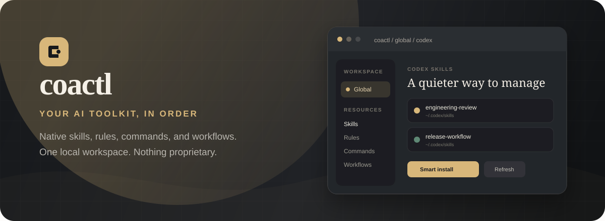

<div align="center">
  
  <br><br>
  <p>
    
    
    
    
  </p>
  <p>
    <a href="#quick-start">Quick start</a> ·
    <a href="#install-a-skill">Install skills</a> ·
    <a href="#portable-profile">Portable profile</a> ·
    <a href="docs/PRD.md">Product details</a>
  </p>
</div>

> **coactl works where your tools already work.** Native files stay native, local files stay local,
> and every change remains visible before it is written.

## Everything in its place

| | |
|:--|:--|
| **See the whole toolkit**<br>Explore resources from Claude Code, Cursor, Codex, Gemini, Zed, OpenCode, and Antigravity. | **Work natively**<br>Edit the files each tool already understands. There is no coactl-specific resource format. |
| **Move with confidence**<br>Copy resources between tools and scopes with a clear preview before anything changes. | **Install from anywhere**<br>Discover complete skills from Git, GitHub, npm, local archives, or remote archives. |
| **Keep your setup portable**<br>Export recent projects and preferences without bundling credentials or native tool content. | **Make it yours**<br>Use a responsive workspace with an elegant light or dark theme and optional login. |

Your skill and rule files remain in their normal tool directories. coactl stores only its own recent
project list and preferences in `~/.coactl/coactl.db`.

## Quick start

> [!TIP]
> Requires Git, npm, and Node.js 20 or newer.

### Install and run in the background

One command installs coactl, starts it, and keeps it running after you close the terminal:

```bash
curl -fsSL https://raw.githubusercontent.com/irvanariyanto/coactl/main/scripts/install.sh | bash -s -- --background
```

Then open **http://127.0.0.1:5173**.

The installer uses `~/.local/share/coactl`, updates an existing installation safely, and writes
background logs to `~/.local/state/coactl/coactl.log`.

### Control coactl

| Action | Command |
|:--|:--|
| **Update and start** | `curl -fsSL https://raw.githubusercontent.com/irvanariyanto/coactl/main/scripts/install.sh \| bash -s -- --background` |
| **Check status** | `curl -fsSL https://raw.githubusercontent.com/irvanariyanto/coactl/main/scripts/install.sh \| bash -s -- --status` |
| **Stop** | `curl -fsSL https://raw.githubusercontent.com/irvanariyanto/coactl/main/scripts/install.sh \| bash -s -- --stop` |

<details>
<summary><strong>Run in the foreground instead</strong></summary>

Use foreground mode when you want logs directly in the terminal. Press `Ctrl+C` to stop coactl.

```bash
curl -fsSL https://raw.githubusercontent.com/irvanariyanto/coactl/main/scripts/install.sh | bash
```

</details>

<details>
<summary><strong>Choose a custom installation directory</strong></summary>

```bash
curl -fsSL https://raw.githubusercontent.com/irvanariyanto/coactl/main/scripts/install.sh | COACTL_INSTALL_DIR="$HOME/coactl" bash -s -- --background
```

</details>

> [!NOTE]
> Background mode survives closing the terminal, but it does not automatically restart after a
> computer reboot.

On the home screen:

1. Choose **Global** to manage resources installed for your user account.
2. Choose **Project** and browse to a folder to manage resources stored in that project.
3. Select a detected AI tool, then open **Skills**, **Rules**, **Commands**, or **Workflows**.

The sidebar keeps your scope, recent projects, tools, and resource types close at hand. On smaller
screens, use the menu button and the compact resource tabs.

## Install a skill

Open a tool's **Skills** page and use **Smart Install**. You can enter any of these source formats:

```text
https://github.com/owner/repository.git
owner/repository
npx skills add addyosmani/agent-skills
some-npm-package
/path/to/skills.zip
https://example.com/skills.tgz
```

For a local `.zip`, `.tgz`, or `.tar.gz` file, select **Browse** instead of typing the path.

coactl shows the skills it discovered before writing anything. Review the destination and overwrite
preview, then choose which skills to install. Complete skill directories are preserved, including
their scripts, references, templates, and other supporting files.

Pasted `npx skills add` commands are parsed only; coactl does not execute them. npm sources are
downloaded with `npm pack`, not installed into your project.

## Copy resources between tools

Open a skill or rule and choose **Import** to copy it to another supported tool or scope. For
example, you can copy a global Claude Code skill into Cursor for one project.

Every import begins with a preview showing whether each destination will be created, skipped, or
overwritten. Nothing is changed until you confirm.

## Portable profile

Use **Portable Profile** from the home screen to export your recent projects and app settings to a
dated JSON file. Importing a profile shows its changes before applying them.

Profiles do not include:

- Skills, rules, commands, or workflows
- Login hashes or session secrets
- Unsaved editor drafts

This makes a profile suitable for moving your coactl setup between machines without bundling your
tool content or credentials.

## Login and remote access

Login is disabled by default for local use. Enable it from **Login & Security** if coactl will be
available to other devices. Passwords are stored as one-way scrypt hashes in
`~/.coactl/auth.json`.

For a remote server, build and start the API with:

```bash
npm run build
COACTL_HOST=0.0.0.0 COACTL_PORT=8787 npm run start
```

The production API does not serve the built web app. Serve `apps/web/dist` separately and proxy
`/api` to port `8787`. Use HTTPS, keep the UI and API on the same trusted origin, enable login
before exposing the service, and run it as a restricted OS user.

## Where files are stored

coactl detects the native locations used by each tool. Common skill locations include:

| Tool | Project | Global |
|------|---------|--------|
| Claude Code | `.claude/skills/` | `~/.claude/skills/` |
| Cursor | `.cursor/skills/` | `~/.cursor/skills/` |
| Codex | `.agents/skills/` | `$CODEX_HOME/skills` or `~/.codex/skills` |
| Gemini | `.gemini/skills/` | `$GEMINI_HOME/skills` or `~/.gemini/skills` |
| Zed | `.agents/skills/` | `$ZED_HOME/skills` or `~/.config/zed/skills` |
| OpenCode | `.opencode/skills/` | `~/.opencode/skills` or `~/.config/opencode/skills` |
| Antigravity | `.antigravity/skills/` | `$ANTIGRAVITY_HOME/skills` or `~/.antigravity/skills` |

Cursor's vendor-managed `skills-cursor` directories are intentionally read-only. When the same
resource exists in more than one physical location, coactl lists each copy separately so you can
choose the correct one.

## Troubleshooting

**A tool does not appear**

Make sure the tool has created its normal configuration directory. In Project mode, confirm that
you selected the correct project folder, then use **Refresh**.

**Refresh would discard my changes**

coactl asks for confirmation when the editor contains unsaved work. Cancel the refresh and save
your changes first if you want to keep them.

**An installed archive has no skills**

The archive must contain one or more directories with a `SKILL.md` file. Legacy packs containing
only `assets/` and `asset.yaml` are not supported.

**I need to move coactl's database**

Set `COACTL_DB_FILE` to the desired SQLite file path before starting the server.

## For contributors

Useful repository commands:

```bash
npm run lint
npm test
npm run build
```

The codebase is split into the React interface in `apps/web`, the Hono API in `apps/server`, and
native resource detection and file operations in `packages/domain`. See [docs/PRD.md](docs/PRD.md)
for the as-built product requirements and current priorities.

The legacy CLI is preserved at tag `cli-v0.1.0` and branch `archive/cli-v0.1`.

## Releases

### 0.4.2

Added a polished one-line installer with foreground and background lifecycle controls, automatic
updates for background installations, and an elegant user-focused README. coactl now displays its
current version and quietly announces newer GitHub releases with a copyable update command.

### 0.4.1

Refresh now reloads the active view while protecting unsaved changes. Desktop resource navigation
lives in the sidebar, while compact resource tabs remain available on smaller screens.

### 0.4.0

Added npm and archive skill installation, GitHub shorthand and Skills CLI input, complete skill
directory installation, portable SQLite profiles, responsive navigation, light and dark themes,
optional login, and a refreshed interface.

### 0.3.0

Added skills, rules, commands, workflows, import previews, Git installation, draft recovery, and
undo delete.

## License

MIT
